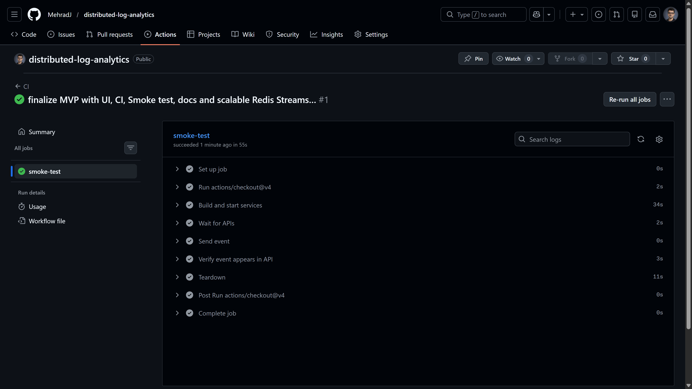

## Distributed Log Analytics

A simple cloud-native, event-driven system for real-time log ingestion and analytics.

### Architecture

- `producer-service` (FastAPI): receives events and writes to Redis Stream (`XADD`)
- `processor-service` (FastAPI + worker thread): reads from Redis Consumer Group (`XREADGROUP`), writes to PostgreSQL, acknowledges messages (`XACK`)
- `api-service` (FastAPI): reads stored logs from PostgreSQL
- `redis`: event stream broker
- `postgres`: persistent storage

### Project Requirements

- Distributed system: multiple services communicating over network
- Real-time shared state updates: events flow in near real-time from producer to DB/API
- Shared distributed state: Redis Stream + PostgreSQL
- Scalability/elasticity: processor can scale horizontally
  - Example: `docker compose up -d --scale processor=3`
- Fault tolerance:
  - if processor is down, events remain in Redis Stream
  - when processor is up again, it consumes pending/new events
- Configurable parameters: stream/group/message/db/redis settings are environment-driven
- Local deployment: Docker Compose
- IaC: declarative infrastructure in `docker-compose.yml`
- CI pipeline: GitHub Actions workflow in `.github/workflows/ci.yml`

### Configuration

Main config is in `.env`:

- `REDIS_STREAM`
- `REDIS_GROUP`
- `DEFAULT_LOG_MESSAGE`
- `REDIS_HOST`, `REDIS_PORT`
- `POSTGRES_*`, `DB_HOST`, `DB_PORT`

### Run Locally

```bash
docker compose up -d --build
```

Open:

- Producer: `http://localhost:8001`
- API: `http://localhost:8002`
- Simple UI: `http://localhost:8002/ui`

Send event:

```bash
curl "http://localhost:8001/send?message=hello"
```

Read logs:

```bash
curl "http://localhost:8002/logs?limit=20"
```

### Functional Smoke Test

Windows PowerShell:

```powershell
.\scripts\smoke_test.ps1
```

This validates:

1. Producer accepts and publishes an event
2. Processor consumes and persists event
3. API can read and return persisted event



### Fault-Tolerance Demo

1. Stop processor:
   - `docker compose stop processor`
2. Send events:
   - `curl "http://localhost:8001/send?message=while-processor-down"`
3. Start processor:
   - `docker compose start processor`
4. Query API logs:
   - `curl "http://localhost:8002/logs?limit=50"`

You should see the events after processor is back.

### CI/CD

Pipeline file: `.github/workflows/ci.yml`

On each push/PR:

1. Build and start all services
2. Send an event via Producer
3. Validate event appears in API logs
4. Tear down environment

Note:

- Dockerfiles already support dynamic cloud ports using `${PORT}`.
- Keep all services in one Railway project so private networking works more easily.

### Limitations

- No advanced monitoring stack (Prometheus/Grafana)
- No multi-region deployment
- No advanced DLQ/replay management
- No full production-grade security hardening

This project intentionally focuses on correctness, distributed event-driven design, and demonstrable cloud engineering basics.
